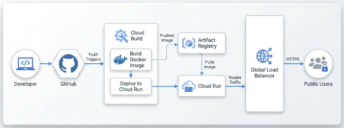

# AI Lab @ Yuting - Cloud Native Blog

Welcome to the **Cloud Native Blog Blueprint** project. This repository houses the source code and infrastructure configuration for [AI Lab @ Yuting](https://ailab.yuting.cc/), a modern static site built with **Hugo**, containerized with **Docker**, and deployed to **Google Cloud Run** via **Terraform** and **Cloud Build**.



## 🚀 Project Overview

Everything in this project is code-defined, following GitOps and Infrastructure as Code (IaC) principles.

*   **Static Site Generator**: [Hugo](https://gohugo.io/) with [PaperMod](https://github.com/adityatelange/hugo-PaperMod) theme.
*   **Containerization**: Multi-stage Docker build using [Chainguard Images](https://images.chainguard.dev/directory/image/nginx/overview) (Nginx) for minimal footprint and security.
*   **Infrastructure**: [Terraform](https://www.terraform.io/) manages GCP resources (Cloud Run, Artifact Registry, Load Balancer, SSL).
*   **CI/CD**: [Google Cloud Build](https://cloud.google.com/build) automatically builds and deploys on every push to `main`.
*   **Agentic Workflow**: Developed using Google's Antigravity Agent.

## 📂 Repository Structure

```text
.
├── cloudbuild.yaml        # CI/CD pipeline configuration
├── create_post.sh         # Helper script to create new blog posts
├── infra/                 # Terraform configuration for GCP infrastructure
│   ├── main.tf
│   ├── services.tf
│   └── variables.tf
├── link-blog/             # Hugo source code
│   ├── content/           # Blog posts and pages
│   ├── static/            # Static assets (images, robots.txt)
│   ├── themes/            # Hugo themes (PaperMod)
│   └── hugo.yaml          # Hugo configuration
└── README.md              # This file
```

## 🛠️ Prerequisites

To develop or deploy this project locally, you need:

*   [Hugo](https://gohugo.io/installation/) (Extended version recommended)
*   [Docker](https://docs.docker.com/get-docker/)
*   [Google Cloud SDK](https://cloud.google.com/sdk/docs/install) (`gcloud`)
*   [Terraform](https://developer.hashicorp.com/terraform/install)

## 💻 Local Development

### Running Hugo Locally

1.  Clone the repository:
    ```bash
    git clone --recursive https://github.com/LinkGitData/hugo.git
    cd hugo
    ```

2.  Start the Hugo development server:
    ```bash
    cd link-blog
    hugo server -D
    ```

3.  Visit `http://localhost:1313` in your browser.

### Creating a New Post

We have a helper script to make this easy:

```bash
# In the root directory
./create_post.sh "Your New Post Title"
```

This will create a new Markdown file in `link-blog/content/posts/` with the correct frontmatter.

## 🚢 Deployment

Deployment is fully automated via Cloud Build.

1.  **Commit & Push**:
    ```bash
    git add .
    git commit -m "New content"
    git push origin main
    ```

2.  **Monitor Build**:
    Go to the [Cloud Build Dashboard](https://console.cloud.google.com/cloud-build/builds) to see the deployment progress.

3.  **Live Site**:
    Once the build completes, the changes will be live at [https://ailab.yuting.cc/](https://ailab.yuting.cc/).

## 🏗️ Infrastructure Setup (Manual / Initial)

If setting up from scratch using Terraform:

```bash
cd infra
terraform init
terraform plan
terraform apply
```

*(Note: Terraform state is stored in a GCS bucket as configured in `main.tf`)*
